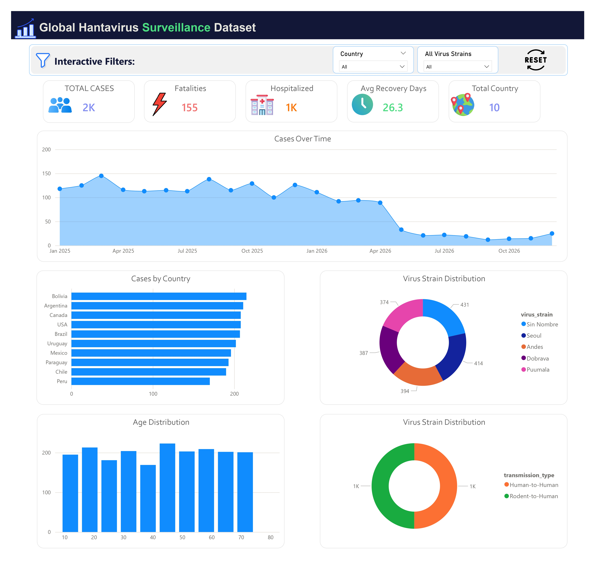

# 🦠 Global Hantavirus Surveillance Dashboard

An interactive Power BI dashboard built on the **Global Hantavirus Surveillance Dataset** from Kaggle, uncovering trends in virus strains, transmission types, case counts, and more across 10 countries.

---

## 📊 Dashboard Preview



---

## 📁 Project Overview

| Detail | Info |
|---|---|
| **Dataset** | Global Hantavirus Surveillance (Kaggle) |
| **Tool** | Power BI Desktop |
| **Domain** | Public Health / Epidemiology |
| **Time Period** | Jan 2025 – Dec 2026 |

---

## 🔑 Key Insights

- **Total Cases:** ~2,000 across 10 countries
- **Fatalities:** 155 (~7.7% fatality rate)
- **Hospitalized:** ~1,000 patients
- **Avg Recovery Days:** 26.3 days
- **Most Affected Country:** Bolivia, followed by Argentina and Canada
- **Dominant Virus Strain:** Sin Nombre (431 cases), followed by Seoul (414) and Andes (394)
- **Transmission Split:** ~50% Rodent-to-Human, ~50% Human-to-Human
- **Age Distribution:** Cases spread almost evenly from age 10 to 80 — no age group is immune
- **Trend:** Sharp decline in new cases after April 2026, possibly reflecting improved containment or surveillance changes

---

## 📈 Dashboard Features

- **Cases Over Time** — Area chart tracking monthly case trends from Jan 2025 to Dec 2026
- **Cases by Country** — Horizontal bar chart comparing all 10 affected countries
- **Virus Strain Distribution** — Donut chart showing the breakdown of 5 strains (Sin Nombre, Seoul, Andes, Dobrava, Puumala)
- **Transmission Type** — Donut chart comparing Rodent-to-Human vs Human-to-Human spread
- **Age Distribution** — Bar chart showing case counts across age groups (10–80)
- **KPI Cards** — Total Cases, Fatalities, Hospitalized, Avg Recovery Days, Total Countries
- **Interactive Filters** — Filter by Country and Virus Strain; reset with one click

---

## 🛠 Tools & Technologies


---

## 📂 Repository Structure

```
📦 hantavirus-surveillance-dashboard
 ┣ 📊 Hantavirus_Dashboard.pbix       # Power BI report file
 ┣ 📁 dataset/
 ┃ ┗ 📄 hantavirus_data.csv           # Raw dataset from Kaggle
 ┣ 🖼 Hantvarius_page-0001.jpg        # Dashboard screenshot
 ┗ 📄 README.md
```

---

## 🚀 How to Use

1. Clone this repository
   ```bash
   git clone https://github.com/Mehtab-Insights/hantavirus-surveillance-dashboard.git
   ```

2. Open `Hantavirus_Dashboard.pbix` in **Power BI Desktop**

3. Use the interactive filters (Country, Virus Strain) to explore the data

---

## 📌 Dataset Source

- **Platform:** [Kaggle](https://www.kaggle.com/)
- **Author:** Mehtab Ahmad
- **Kaggle Profile:** [kaggle.com/mehtab1](https://www.kaggle.com/mehtab1)

---
